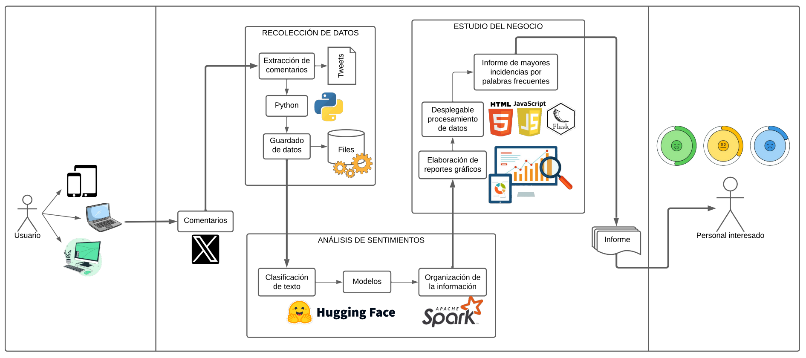

# Extracción de tweets con Python y Flask

Este proyecto contiene las funciones de extracción y elaboración del dataset final, así como los gráficos y mapa de calor según localizaciones. Se apoya en la calificación de los textos con un modelo BERT, conexión a X (antes Twitter) usando credenciales de cuenta personal (API), análisis de sentimientos y disponible para integrarse con una plataforma web (frontend).

<hr/>

En primer lugar, crear el entorno virtual:
`python -m virtualenv env` o `virtualenv -p python3 env`

Activación: `.\env\Scripts\activate`

Instalación de los paquetes: `pip install -r requirements.txt`

<hr>

<em><ins>Nota</ins>: En el archivo **config.ini**, colocar vuestras credenciales de X (uso local, se creará un cookies.json)</em>

Los parámetros a digitar en la función de extracción, deben ir en este formato JSON:

```json
{
  "query": "",
  "anio": "",
  //Desde aquí es opcional
  "loc": {
    "latitud": "",
    "longitud": "",
    "radio": "",
    "lang": ""
  }
}
```
<hr/>

# Organización del proyecto 📁

